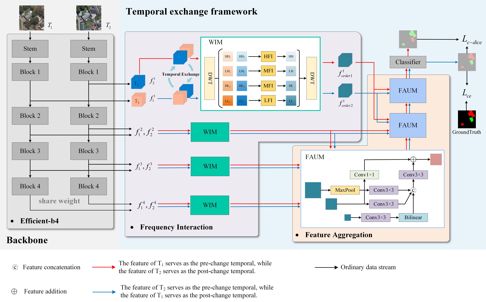

# FDINet
## An Object Fine-Grained Change Detection Method Based on Frequency Decoupling Interaction for High Resolution Remote Sensing Images (TGRS 2023)

This repository is the official implementation:
> [An Object Fine-Grained Change Detection Method Based on Frequency Decoupling Interaction for High Resolution Remote Sensing Images](https://ieeexplore.ieee.org/document/10335719)  
> Yingjie Tang, Shou Feng, Chunhui Zhao, Yuanze Fan, Qian Shi, Wei Li, Ran Tao

## 📄 Abstract

Change detection is a prominent research direction in the field of remote sensing image processing. However, most current change detection methods focus solely on detecting changes without being able to differentiate the types of changes, such as “appear” or “disappear” of objects. Accurate detection of change types is of great significance in guiding decision-making processes. To address this issue, this article introduces the object fine-grained change detection (OFCD) task and proposes a method based on frequency decoupling interaction (FDINet). Specifically, in order to enhance the model’s ability to detect change types and improve its robustness to temporal information, a temporal exchange framework is designed. Additionally, to better capture spatial–temporal correlation in bi-temporal features, a wavelet interaction module (WIM) is proposed. This module utilizes wavelet transform for frequency decoupling, separating features into different components based on their frequency magnitudes. Then the module applies different interaction methods according to the characteristics of these frequency components. Finally, to aggregate complementary information from different-scale feature maps and enhance the representational capabilities of the extracted features, a feature aggregation and upsampling module (FAUM) is adopted. A series of experiments show the superiority of FDINet over most state-of-the-art methods, achieving good results on three different datasets.

## 🎮 Framework


## 📧 Contact

If you have any issues while using the project, please feel free to contact me: [tangyj@hrbeu.edu.cn](tangyj@hrbeu.edu.cn).

## 📚 Citation

If you find our work useful, please consider citing our paper:

```bibtex
@article{tang2023object,
  title={An object fine-grained change detection method based on frequency decoupling interaction for high-resolution remote sensing images},
  author={Tang, Yingjie and Feng, Shou and Zhao, Chunhui and Fan, Yuanze and Shi, Qian and Li, Wei and Tao, Ran},
  journal={IEEE Transactions on Geoscience and Remote Sensing},
  volume={62},
  pages={1--13},
  year={2023},
  publisher={IEEE}
}
```

## 📜 License

Licensed under a [Creative Commons Attribution-NonCommercial 4.0 International](https://creativecommons.org/licenses/by-nc/4.0/) for Non-commercial use only.
Any commercial use should get formal permission first.
